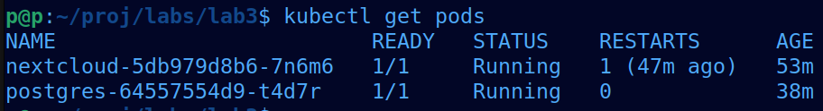
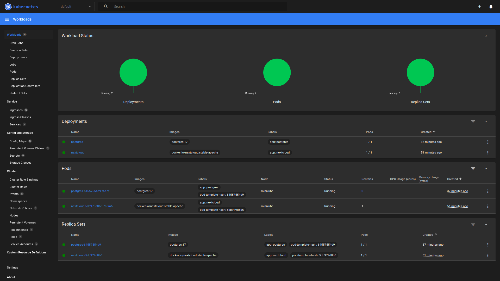
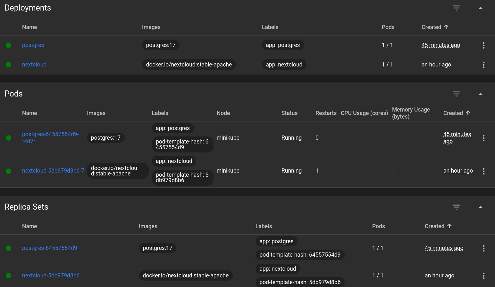
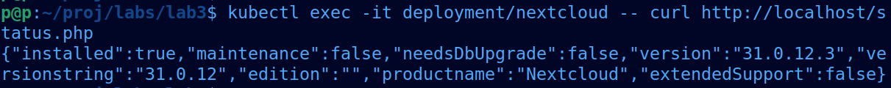

Порядок имеет значение, потому что Deployment использует ConfigMap и Secret.

Если применить Deployment раньше — pod не будет создан.

Корректный порядок:
1. ConfigMap и Secret
2. Service
3. Deployment

Для локального доступа к сервису используется Service типа NodePort.

Туннелирование трафика:
minikube service nextcloud-service

При scale = 0:
- Pod PostgreSQL уничтожается
- Nextcloud теряет соединение с БД
- UI становится недоступен

При scale = 1:
- PostgreSQL стартует заново
- Данные сохраняются, так как используется PVC
- Nextcloud снова начинает работать

В ходе работы:
- POSTGRES_USER и POSTGRES_PASSWORD вынесены в Secret
- Конфигурация Nextcloud вынесена в ConfigMap

Для проверки состояния Nextcloud используются liveness и readiness probes.

В качестве health-endpoint применяется путь:
/status.php

Проверка состояния сервиса:

kubectl exec -it deployment/nextcloud -- curl http://localhost/status.php

