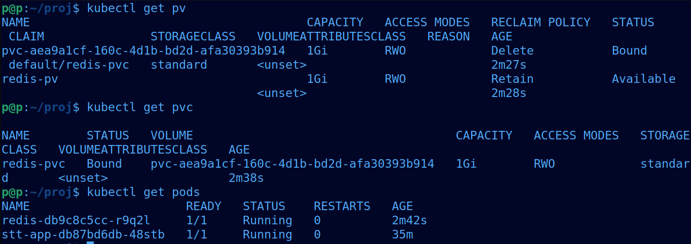

## Подготовка Docker-образа приложения

В качестве основы был использован `Dockerfile.good` из лабораторной работы №1.  
Образ содержит FastAPI-приложение для STT и все необходимые зависимости.

Образ был собран локально с помощью Docker и загружен в Kubernetes-кластер **minikube** через встроенный registry.

---

## Развёртывание Kubernetes-кластера

Для выполнения лабораторной работы был использован локальный Kubernetes-кластер **minikube**.

В кластере были созданы следующие ресурсы:

- `Deployment` для приложения **stt-app**
- `Deployment` для **Redis**
- `Service` для **Redis**
- `ConfigMap` с переменными окружения
- `PersistentVolume` и `PersistentVolumeClaim` для **Redis**
- `InitContainer` для ожидания готовности Redis

---

## Настройка связки сервисов

Приложение **stt-app** зависит от **Redis**.  
Для Redis был создан Kubernetes `Service`, благодаря чему приложение может обращаться к Redis по DNS-имени сервиса (`redis`).

Для хранения данных Redis используется `PersistentVolumeClaim`, который монтируется в контейнер Redis по пути `/data`.

Для гарантии корректного порядка запуска был добавлен `init-container`, который ожидает доступности Redis перед стартом основного контейнера приложения.

---

## Настройка readiness-probe

В `Deployment` приложения была добавлена `readinessProbe`, которая проверяет доступность эндпоинта `/health`.

В связи с тем, что при старте приложение загружает ML-модель, был увеличен параметр `initialDelaySeconds`,  
чтобы избежать преждевременного определения контейнера как неготового.

---

## Использование labels

Для Kubernetes-ресурсов были заданы дополнительные `labels`, помимо обязательных  
`selector` / `matchLabels`, для логической группировки и удобства управления ресурсами.

---

## Проверка работоспособности

После применения всех манифестов было проверено:

- все pod’ы находятся в статусе `Running`
- Redis доступен через `Service`
- `PersistentVolumeClaim` успешно привязан к `PersistentVolume`
- приложение успешно проходит `readiness-probe`

